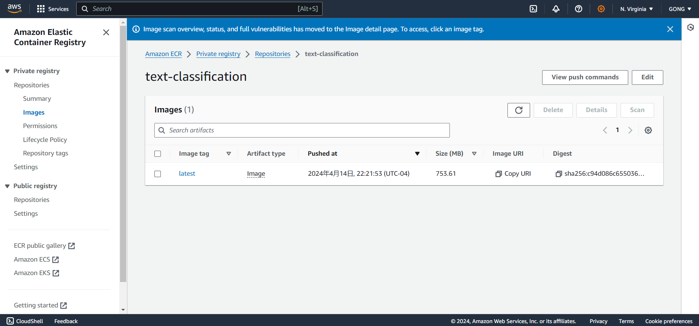
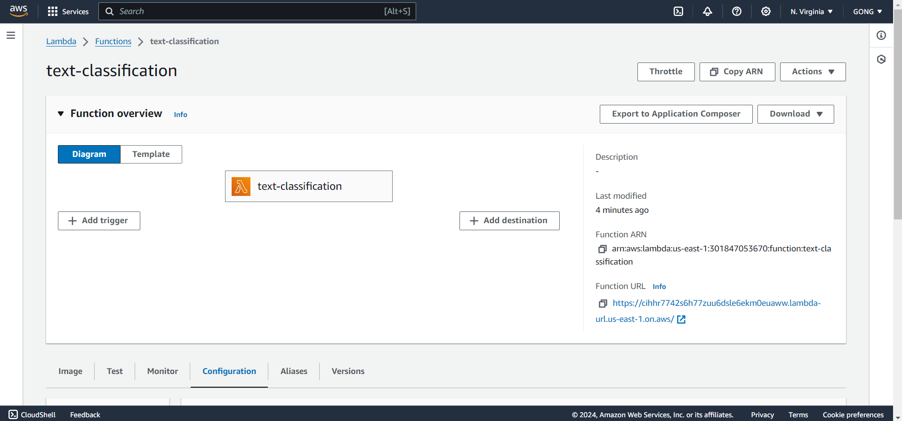
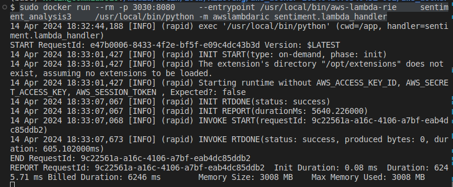
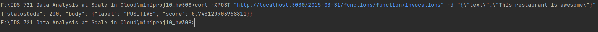

# Serverless Transformer Endpoint
This text classification used a Docker container to deploy a machine learning model that analyzes text to determine its sentiment and deployed the container to AWS lambda with query endpoint. It will return a sentiment label(positive/negative/neutral) with its confidence score. 

## Getting started

**1. Transformer packaging**

The pre-trained model `distilbert-base-uncased-finetuned-sst-2-english` is selected from Hugging Face’s Transformers library, which is designed for sentiment analysis. This model is trained on the Stanford Sentiment Treebank (SST-2) dataset and is capable of classifying text into positive or negative sentiments.

**2. Development Environment**

The project utilizes Docker, which helps in creating a consistent development environment that can be easily moved to production or other machines without compatibility issues. `docker build -t text-classification .`

**3. AWS Integration**

The project uses the Amazon ECR (Elastic Container Registry) for storing Docker images and AWS Lambda for running code without provisioning or managing servers. This setup allows to scale and manage the application's deployment efficiently. 

```
aws ecr create-repository --repository-name text-classification --region us-east-1

aws ecr get-login-password --region us-east-1

aws ecr get-login-password --region us-east-1 | docker login --username AWS --password-stdin account_id.dkr.ecr.us-east-1.amazonaws.com

docker tag text-classification:latest account_id.dkr.ecr.us-east-1.amazonaws.com/text-classification:latest

docker push account_id.dkr.ecr.us-east-1.amazonaws.com/text-classification:latest
```

**4. API and Serverless Deployment**

This application is designed to be deployed as a serverless function, which is accessible via an HTTP API. This is managed through AWS Lambda, which can handle requests and scale automatically. The AWS Lambda Runtime Interface Emulator (RIE) is used locally to mimic this environment, allowing for local testing before deployment.

```
# Dockerfile Configuration for RIE:
# Download the AWS Lambda RIE
ADD https://github.com/aws/aws-lambda-runtime-interface-emulator/releases/latest/download/aws-lambda-rie /usr/local/bin/aws-lambda-rie

# Provide execute permissions for the AWS Lambda RIE
RUN chmod +x /usr/local/bin/aws-lambda-rie

# Specify the entrypoint as the AWS Lambda RIE
ENTRYPOINT [ "/usr/local/bin/aws-lambda-rie" ]
```

**5. Endpoint Functionality**

Using cURL request against endpoint for testing the functionality of this application.

```
# run 
sudo docker run --rm -p 3030:8080 --entrypoint /usr/local/bin/aws-lambda-rie text-classification /usr/local/bin/python -m awslambdaric app.lambda_handler

# request
curl -XPOST "http://localhost:3030/2015-03-31/functions/function/invocations" -d "{\"text\":\"This restaurant is awesome\"}"
```


## Screenshots for the Procedure
- Amazon ECR Repository 


- AWS Lambda Function


- Run the application 


- cURL Request with response


